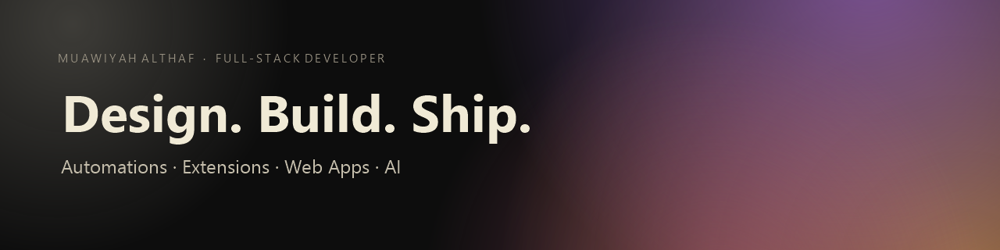

  

<h1 align="center">Muawiyah Althaf</h1>

  <b>Full-Stack Developer · Bangalore, India</b>
   
  I build automations, Chrome extensions, web apps &amp; AI tools — from idea to live deployment.

  <a href="https://muawiyah.up.railway.app">Portfolio</a>
  &nbsp;·&nbsp;
  <a href="https://www.linkedin.com/in/muawiyah-althaf">LinkedIn</a>
  &nbsp;·&nbsp;
  <a href="mailto:muawiyahalthaf@gmail.com">Email</a>

---

## About

I'm a full-stack developer who ships clean, functional products end-to-end — **React & Next.js** on the frontend, **Node & Supabase** on the backend, with **AI** woven in where it earns its place. I've built browser extensions, SaaS platforms, data dashboards and AI-powered tools for clients worldwide, and I love turning a messy manual process into a smooth automation.

When I'm not coding, I'm gaming (PS5 — Valorant & Fortnite), on a football pitch (ex-college team captain), or playing badminton and basketball.

- **Currently** — freelancing & building automations, extensions and AI tools
- **Focused on** — clean architecture, thoughtful motion & design, real AI integration
- **Ask me about** — Chrome extensions, Next.js SaaS, or automating boring workflows
- **Reach me** — muawiyahalthaf@gmail.com

## Tech Stack

**Frontend** &nbsp; `TypeScript` `JavaScript` `React` `Next.js` `Tailwind CSS` `Framer Motion`

**Backend** &nbsp; `Node.js` `Supabase` `PostgreSQL` `FastAPI` `REST APIs`

**AI & Tools** &nbsp; `Claude / Anthropic API` `OpenAI` `Three.js / R3F` `Chrome Extensions (MV3)` `Git` `Vercel` `Railway`

## Featured Projects

| Project | What it does |
| --- | --- |
| **[Hirerchy Extension](https://chromewebstore.google.com/)** | One-click job-application autofill (Manifest V3) across Workday, Greenhouse & iCIMS. |
| **[Hirerchy](https://hirerchy.com)** | End-to-end SaaS for a job-application agency — 3 roles, live application tracker, built-in messaging. |
| **[Acadewin](https://acadewin.com)** | AI exam-prep — generates & auto-marks questions, builds flashcards, and summarises documents. |
| **FitStudio** | Browser-based 3D virtual fitting room built with Three.js & React Three Fiber. |
| **Dhanaya** | Data-driven profit-and-loss dashboard turning raw sales data into clear, actionable margins. |

## GitHub Stats

  
  

---

<i>Available for work — tell me what you need, and I'll build it.</i>

